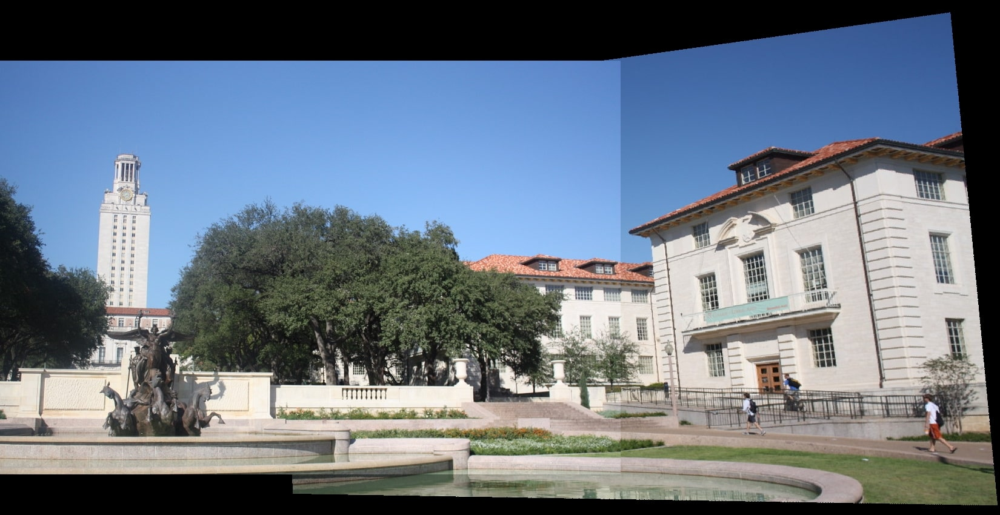

# Part 1: Augmented Reality with Planar Homographies
This part explores implementing an Augmented Reality (AR) application using planar homographies.

## Key Steps:
1. **Finding Correspondences:**

    Extract keypoints and matches between book image and first video frame using SIFT and brute-force matching.

2. **Compute Homography Matrix:**

    Solve the system of linear equations Ax = b to find unknown homography parameters.

3. **Calculate Book Coordinates:**

    Map the four book cover corners to the first video frame using the homography matrix.

4. **Crop AR Video Frames:**

    Calculate and crop a central region from each video frame to match the book cover aspect ratio.

5. **Create AR Application:**

    1. Compute homography between the book cover and all frames.

    2. Update book corner locations in each frame based on the new homography.
   
    3. Overlay cropped video frames onto corresponding book frames, creating the final AR video.

## Results

    

    <em>Matches between the book cover image and the first frame in the video</em>

    

    <em>Comparison between the find homography parameters method and the built-in in OpenCV</em>

    

    <em>First frame of the AR video</em>

# Part 2: Image Mosaics (Markdown)
This part implements an image stitcher using image warping and homographies.

## Key Step:

  1. Create a merged image large enough to hold both input images after alignment.
    
  2. Warp one image onto the other, fixing black pixels using inverse warping.

## Results

    

    <em>Holes generated in forward warping</em>

    

    <em>Fixing holes using the inverse warping</em>

    

    <em>Stiching the first and second image</em>

    

    <em>Stiching the resulted image and third image</em>

